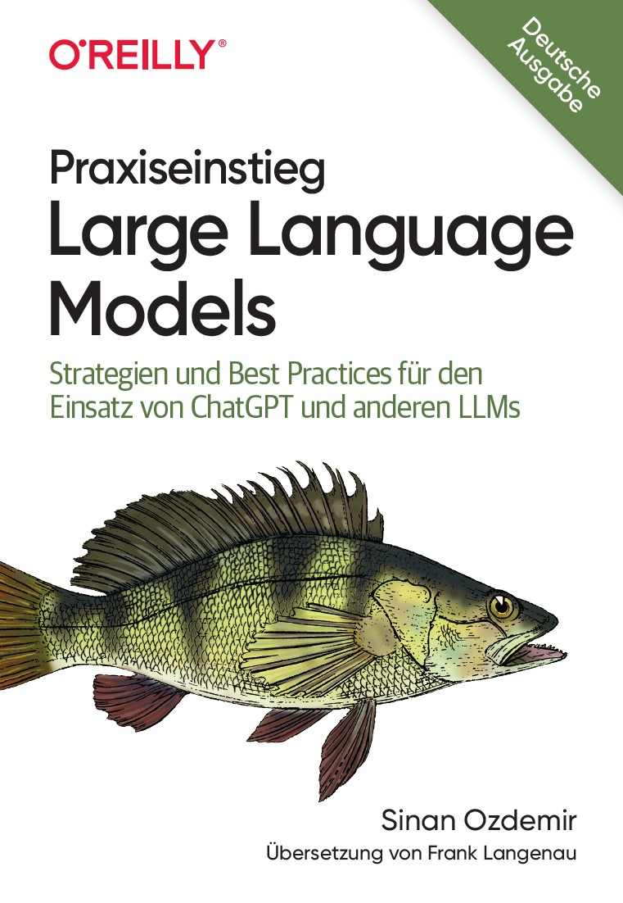

# Conversational RAG

This project implements a Retrieval-Augmented Generation (RAG) pipeline using Python. RAG combines information retrieval with generative models to answer queries based on both external documents and language model capabilities. 
## Tools & Technologies

## External Document
As external document it uses the book 'Praxiseinstieg Large Language Models' by Sinan Ozdemir (German edition).

## Features

- Document ingestion and splitting
- Vectorization of documents for efficient retrieval
- Integration with a language model for generating answers

## Process Overview
1. **Document Ingestion**: Load documents from a specified directory.
2. **Document Splitting**: Split documents into manageable chunks.
3. **Vectorization**: Convert document chunks into vector embeddings. Embeddings are numerical representation of text that capture semantic meaning.
4. **Storage**: Store the vectorized chunks in a vector store for efficient retrieval.
4. **Retrieval**: Use a vector store to retrieve relevant chunks based on a query.

## Project Structure

- `main.py`: Main script to run the RAG pipeline.