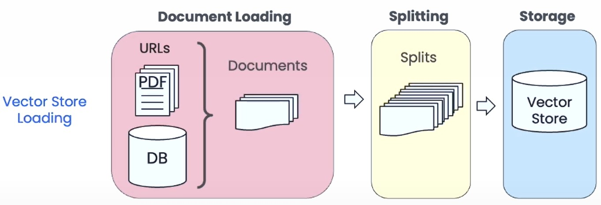
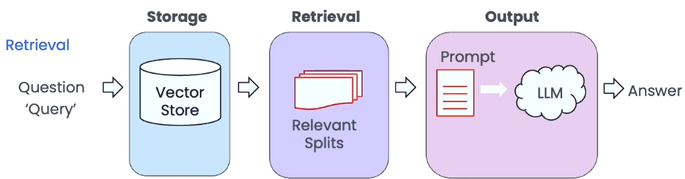

# Conversational RAG

This project implements a Retrieval-Augmented Generation (RAG) pipeline using Python. RAG combines information retrieval with generative models to answer queries based on both external documents and language model capabilities. 
## Tools & Technologies


# Table of Contents
- [Process Overview](#process-overview)
  - [Vector store loading](#vector-store-loading)
  - [retrieval](#retrieval)
- [External Document](#external-document)
- [Project Structure](#project-structure)
- [Installation and Usage](#installation-and-usage)
- [Contributing](#contributing)


## Process Overview
### Vector store loading
- **Document Ingestion**: Load documents from a specified directory.
- **Document Splitting**: Split documents into manageable chunks.
- **Vectorization**: Convert document chunks into vector embeddings using OpenAI embeddings `text-embedding-3-small`. Embeddings are numerical representation of text that capture semantic meaning. 
- **Storage**: Store the vectorized chunks in a vector store (Chroma) for efficient retrieval.

<p align="left">
    
</p> 

*Source: DeepLearning.AI*

### retrieval
- **Retrieval**: Use a vector store to retrieve relevant chunks based on a query. Integration with a large language model `gpt-4o-mini` for generating answers.
- **Answer Generation**: Generate answers using the retrieved chunks and the language model.
- **Contextual Awareness**: Maintain conversation history to provide context for follow-up questions.
- **Source Document Display**: Show the source documents used to generate the answer.

<p align="left">
    
</p> 

*Source: DeepLearning.AI*

## External Document
As external document it uses the book 'Praxiseinstieg Large Language Models' by Sinan Ozdemir (German edition).

<p align="center">
    
</p>

## Project Structure

- `README.md`: This file, providing an overview of the project.
- `streamlit-rag/`: Contains the Streamlit app for the RAG process.
- `history_aware_rag.py`: Implements the RAG pipeline with history-aware retrieval.
- `src/`: Contains utility functions for document loading, splitting, and vectorization.
- `basics/`: Jupyter notebooks demonstrating concepts for the RAG process.
- `requirements.txt`: Lists the required Python packages for the project.
- `vector_store/`: Contains the vector store implementation using Chroma.

# Installation and Usage
Create a .env file in the root directory with the following content:
```plaintext
OPENAI_API_KEY=your_openai_api_key
```
It´s recommended to use a virtual environment to manage dependencies. You can use `conda` for this purpose. The following commands will create a new conda environment and install the required packages:   
```bash
conda create -n rag-env python=3.13
conda activate rag-env
pip install -r requirements.txt
```
After creating the environment and installing the dependencies, you can run the streamlit app with the following command:
```bash
streamlit run streamlit-rag/app.py
```
Now the terminal should display a message indicating that the app is running on `http://localhost:8501`. You can open this URL in your web browser to access the app.
You can now enter your questions in the input field and the LLM will answer them based on the ingested documents. The app also displays the source documents used to generate the answer, allowing you to verify the information provided by the LLM. 

<p align="center">
    <video width="600" controls>
        <source src="img/rag_chat.mp4" type="video/mp4">
        Your browser does not support the video tag.
    </video>
</p>

Follow up questions are also supported, allowing you to ask further questions based on the previous answers. The app will maintain the context of the conversation and provide relevant answers based on the ingested documents.

<p align="center">
    <video width="600" controls>
        <source src="img/history-aware_rag_chat.mp4" type="video/mp4">
        Your browser does not support the video tag.
    </video>
</p>

If the LLM does not have enough context to answer a question, it will inform you about it. You can then provide additional context or ask a different question.

<p align="center">
    <video width="600" controls>
        <source src="img/outofcontext_rag_chat.mp4" type="video/mp4">
        Your browser does not support the video tag.
    </video>
</p>